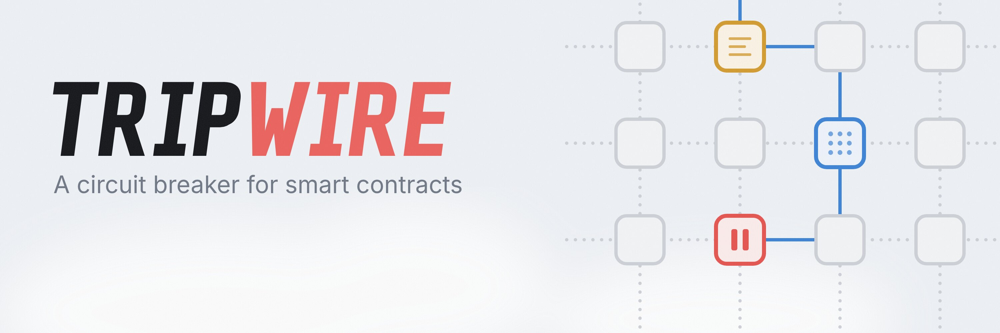
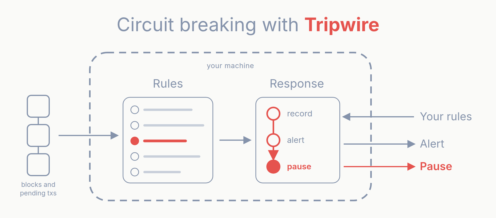
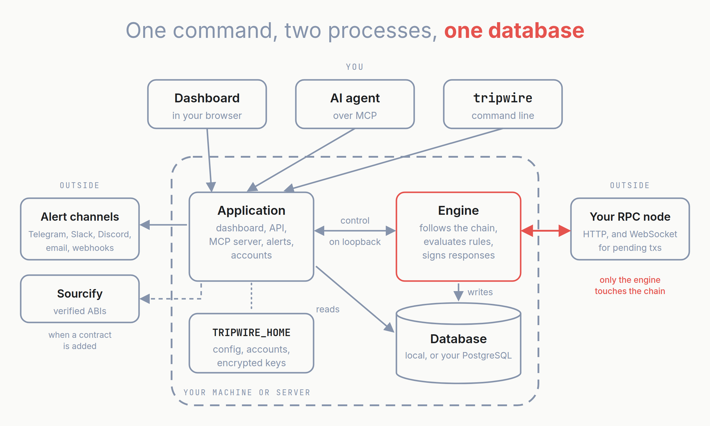
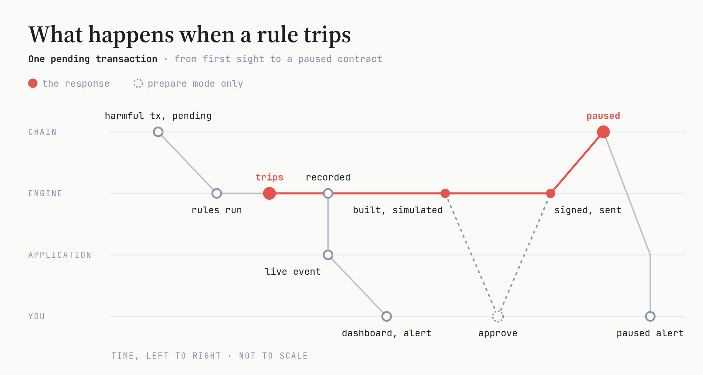
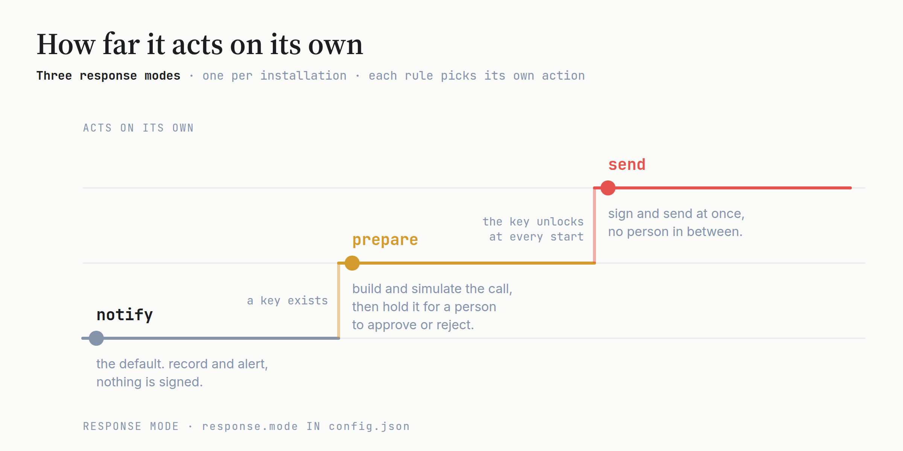

<div align="center">

<picture>
  <source media="(prefers-color-scheme: dark)" srcset="assets/banner-dark.jpg">
  
</picture>

<br/>
<br/>

# Tripwire: A Circuit Breaker for Smart Contracts

<p align="center"><b>Real-time Rules&nbsp; ◦ &nbsp;Pending-Transaction Detection&nbsp; ◦ &nbsp;On-chain Pause&nbsp; ◦ &nbsp;Runs on Your Machine</b></p>

<h4 align="center">
  <a href="#quickstart">🚀 Quickstart</a>&nbsp; • &nbsp;
  <a href="#how-it-works">🧭 How it works</a>&nbsp; • &nbsp;
  <a href="#security-model">🛡️ Security</a>&nbsp; • &nbsp;
  <a href="specs/HIGH-LEVEL-SPEC.md">📐 Design</a>&nbsp; • &nbsp;
  <a href="specs/MCP-SERVER.md">🤖 MCP</a>&nbsp;
</h4>

</div>


<details open>
<summary><h2>Updates</h2></summary>

- [Sep '26] 🔥 **Engine by download**: `tripwire start` installs the signed engine release and verifies it before running it. There is no manual install step.
- [Sep '26] ⚡ **On-chain response**: a tripped rule can pause its contract or call any admin function you choose, with a readiness checklist on every contract and approvals in `prepare` mode.
- [Sep '26] 🤖 **MCP server**: AI agents can list your contracts and rules, and draft and submit new rules, over the Model Context Protocol.
- [Sep '26] 🔑 **Signing keys**: create a key or import a keystore from the dashboard. While a key a rule relies on is locked, every page says so in red.

</details>


# What is Tripwire?

Most exploits drain a contract in a single transaction. An alert that reaches a person after that transaction has landed is a post-mortem. What a protocol needs is something that **knows what must always hold**, **notices the moment it stops holding**, and **acts before the damage is done**.

**Tripwire** continuously re-checks a set of **rules**, statements about your protocol that should always hold and things that should never happen:

- "the vault's exchange rate never deviates more than 5% from its own 20-minute average"
- "totalAssets never drops below totalSupply"
- "no more than 5% of supply is minted within 24 hours"
- "this oracle updates at least every hour"
- "this event never appears in a transaction touching our pool"

When a rule trips, Tripwire:

1. **Records it** with full evidence: the values, the block, the transaction that caused it.
2. **Alerts you** on your channels: chat, paging, or your own systems.
3. **Optionally responds on-chain**: it calls your contract's own pause function, or any admin function you choose, with a key you give it.

<div align="center">
<picture>
  <source media="(prefers-color-scheme: dark)" srcset="assets/framework-dark.png">
  
</picture>
</div>

Between violations you get a live dashboard: current values, historical charts, which rules are tripped, and the health of the monitor itself.

### TL;DR

<blockquote>Tripwire <b>watches every block and pending transaction</b> for the contracts you care about, <b>evaluates rules you write in plain terms</b>, <b>alerts</b> the moment one breaks, and can <b>pause the contract on-chain</b> before an exploit drains it. It runs entirely on <b>your machine</b>, with <b>your RPC</b>, <b>your database</b> and <b>your keys</b>.</blockquote>

### Compare with alert-only monitoring

| | Alert-only monitoring | **Tripwire** |
|---|---|---|
| **Sees** | usually, transactions after they land | every block, and pending transactions before they land |
| **Responds** | pages a person, who then has to act | pauses the contract itself, or holds the call for one approval |
| **Power it needs** | none | only what you grant: a pause-only role is enough |
| **Runs on** | someone else's infrastructure | your machine, your RPC, your database, your keys |


# Quickstart

```sh
pnpm install && pnpm build
alias tripwire="node $PWD/packages/cli/dist/tripwire.mjs"

tripwire setup
tripwire start
```

Open http://127.0.0.1:4747, add a contract, create a rule, add an alert channel. That is a working monitor: every block is checked, and every trip is recorded and alerted. No keys, no on-chain changes.

### What you need

- Linux on x86-64 or ARM64 (a container or WSL works elsewhere).
- Node.js 22.14 or later.
- An RPC endpoint for your chain. Add a WebSocket endpoint as well to watch pending transactions.
- Nothing else: a local database is created for you. To use your own PostgreSQL instead, have its URL ready.

### Set up

`tripwire setup` asks for the database (local by default), your first account, and the chain with its RPC endpoints. It installs the engine and checks the endpoints through it before writing anything. For scripts and containers every answer has a flag, and the password comes from `TRIPWIRE_PASSWORD`:

```sh
TRIPWIRE_PASSWORD=... tripwire setup --username ops --chain-id 1 \
  --rpc-http env:TRIPWIRE_RPC_HTTP --rpc-ws env:TRIPWIRE_RPC_WS
```

You can also skip `setup` and run `tripwire start` straight away: the dashboard's first page asks the same questions.

### Start it

`tripwire start` installs and verifies the engine, then serves the dashboard at http://127.0.0.1:4747. The bar at the top of Overview says whether the engine is following the chain. `tripwire engine status` and `tripwire engine log --follow` tell you the same from a terminal.

### Watch your first contract

1. **Contracts, Add contract.** Paste the address. A verified contract's ABI comes from Sourcify, proxies included; otherwise paste the ABI.
2. **New rule.** Pick a starting point (never drops below, stays near its average, growth limit, outflow limit, stays fresh, event never appears, or a custom comparison), fill in the blanks, and Tripwire evaluates it against the current block before you save it.
3. **Settings, Alert channels.** Add Telegram, Slack, Discord, email or a webhook, and send a test.

### [Respond on-chain →](#on-chain-response)

Give a rule a key and an action, and it pauses the contract when it trips.

### Try it without a chain

```sh
TRIPWIRE_ENGINE=stand-in tripwire start
```

runs the whole dashboard on simulated blocks and values, with no engine and no RPC: for a look around, or for working on the application.


# How it works

Tripwire is one command, `tripwire start`, that runs two processes on your machine and keeps everything they know in one database.

<div align="center">
<picture>
  <source media="(prefers-color-scheme: dark)" srcset="assets/architecture-dark.png">
  
</picture>
</div>

| Piece | What it does |
|---|---|
| **Application** (this repo) | Serves the dashboard and a local API, runs the MCP server for AI agents, manages accounts, delivers alerts, and starts, checks and restarts the engine. It never talks to the chain itself. |
| **Engine** | A signed native binary the application installs and runs. It follows every block, reads contract state, evaluates your rules against a local copy of the chain, records values and violations, and, when a rule says so, builds, signs and sends the response. |
| **Database** | Everything Tripwire knows: contracts, rules, recorded values, violations, responses. A local database is created for you on first start, or you point it at your own PostgreSQL. |
| **TRIPWIRE_HOME** | `~/.tripwire` by default: `config.json`, the accounts, alert channel secrets, and the engine's keystore files, encrypted with your passphrase. |
| **The contracts** (optional) | The TripwireController, an on-chain circuit breaker for contracts that want pause-only power they can hand to Tripwire. Tripwire works without it. |

Only the engine touches your RPC. The application reads what the engine has recorded and sends it commands over a local connection guarded by a secret only the two of them share. See [specs/HIGH-LEVEL-SPEC.md](specs/HIGH-LEVEL-SPEC.md) for the full design.

### What happens when a rule trips

<div align="center">
<picture>
  <source media="(prefers-color-scheme: dark)" srcset="assets/trip-dark.png">
  
</picture>
</div>

The engine evaluates every rule on each new block, and on each pending transaction for rules that watch them. A tripped rule is recorded with its evidence, the dashboard updates at once, and you are alerted on your channels. If the rule acts on chain and the response mode allows it, the engine builds the call, simulates it, and signs and sends it, escalating fees if it gets stuck, then records the transaction and alerts you that the contract is paused.

A rule that watches pending transactions trips before the harmful transaction lands, which is what gives an on-chain response time to arrive first.

### How far it acts on its own

<div align="center">
<picture>
  <source media="(prefers-color-scheme: dark)" srcset="assets/modes-dark.png">
  
</picture>
</div>

The installation runs in one of three **response modes**; each rule separately chooses its action: just notify, pause the contract, or call a function you pick. The mode is `response.mode` in `config.json` (or `TRIPWIRE_RESPONSE_MODE` for one run), applied when Tripwire starts. `send` needs the key passphrase in `TRIPWIRE_KEYS_PASSPHRASE`, so the key unlocks by itself after a restart; without it the engine refuses to start in `send`.


# On-chain response

Optional, and only once you are happy with what Tripwire watches:

1. **Settings, Keys.** Create a key, or import a keystore.
2. **Fund it.** Send it a little ETH for gas.
3. **Grant it the right to pause**, from your contract's admin: a pauser role, never ownership.
4. **Give a rule an on-chain action**: pause, or call a function.
5. **Test the response.** It is simulated from the key; nothing is sent.
6. **Set the response mode** in `config.json`: `prepare` first, then `send`.

The contract's page shows a readiness checklist for exactly this, and tells you when the key holds more power than it needs. While the key a rule relies on is locked, every page of the dashboard says so in red.


# Reference

### Where things live

| Where | What |
|---|---|
| `~/.tripwire/config.json` | chain, RPC endpoints (or `env:` references to them), database choice, response settings |
| `~/.tripwire/users.json`, `sessions.json` | accounts, with scrypt password hashes, and open logins |
| `~/.tripwire/engine/keys/` | one encrypted keystore file per key; any Ethereum tool opens them. The file is the key: back it up by copying it |
| `~/.tripwire/engine/bin/<version>/` | the verified engine release |
| `~/.tripwire/logs/engine.log` | the engine's output |
| `~/.tripwire/db/` | the local database, when you did not choose your own PostgreSQL |

Set `TRIPWIRE_HOME` to keep all of it somewhere else.

### Security model

- **Notify-only by default.** Tripwire holds no keys until you create one, and signs nothing until you choose a response mode that does.
- **Give it the least power that works.** Tripwire can do on-chain only what its key is allowed to do. Grant a role that can pause and nothing more, never an owner or admin key that could also upgrade the contract or move funds; the dashboard warns when a key holds more. A contract with no pause-only role can use the TripwireController, where the key you hand Tripwire can pause and un-pause and nothing else.
- **Keys stay in the engine.** A passphrase passes through the application to the engine and is never stored, returned or logged.
- **Local by default.** The dashboard and interface are only reachable from your machine unless you deliberately expose them, and every request needs a login even then.

### Status

Pre-release. The application and engine are under active development; the optional contracts are deployed and verified. Nothing here is audited for third-party production use yet.


---

# ⭐ Support Us

Leave us a star 🌟 if Tripwire is useful to you, or if you want to follow it to its first release. Thank you!


---

<picture>
  <source media="(prefers-color-scheme: dark)" srcset="assets/wordmark-dark.svg">
  
</picture>
