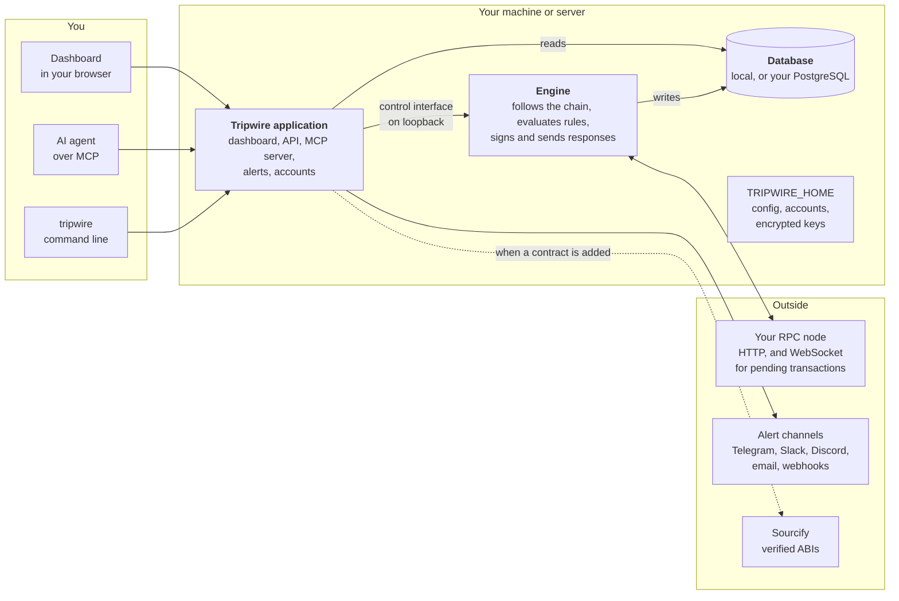
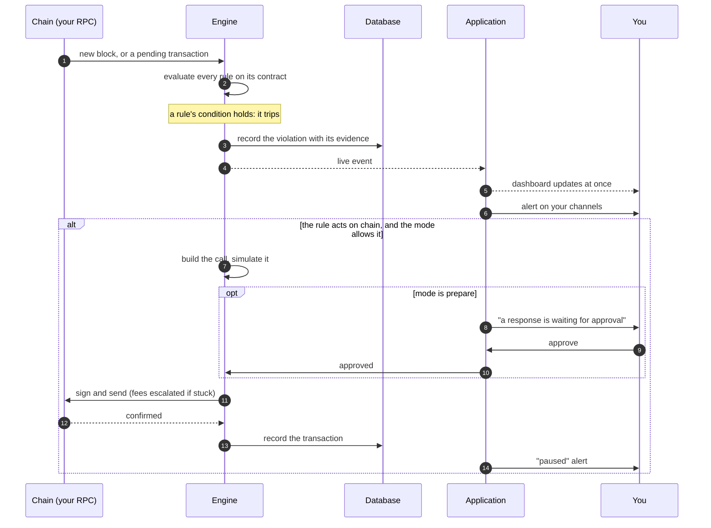
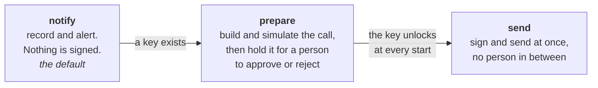
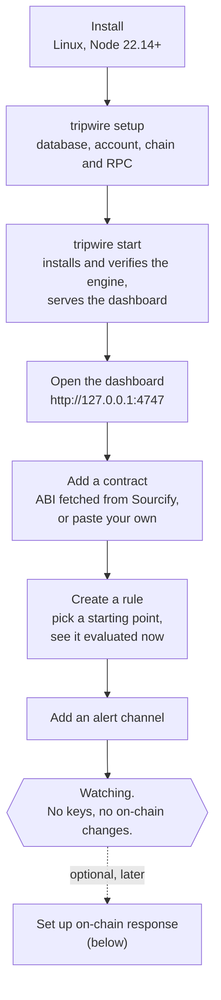
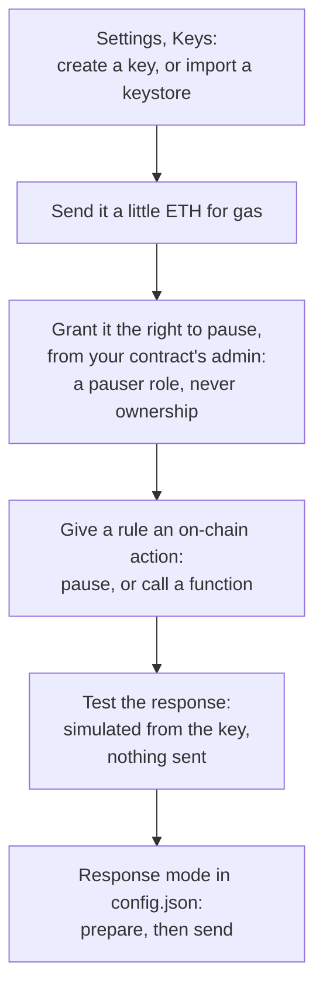

# Tripwire

**A circuit breaker for smart contracts.** Tripwire watches your on-chain
contracts in real time, evaluates safety rules you define, alerts you the
moment one breaks, and can pause the affected contract before an exploit
drains it. It runs entirely on your own machine or server: your RPC, your
database, your keys.

## What it does

Tripwire continuously re-checks a set of **rules**, statements about
your protocol that should always hold and things that should never
happen:

- "the vault's exchange rate never deviates more than 5% from its own
  20-minute average"
- "totalAssets never drops below totalSupply"
- "no more than 5% of supply is minted within 24 hours"
- "this oracle updates at least every hour"
- "this event never appears in a transaction touching our pool"

When a rule trips, Tripwire:

1. **Records it** with full evidence: the values, the block, the
   transaction that caused it.
2. **Alerts you** on your channels: chat, paging, or your own systems.
3. **Optionally responds on-chain**: it can call your contract's own
   pause function, or any admin function you choose, with a key you
   give it, before the damage is done.

Between violations you get a live dashboard: current values, historical
charts, which rules are tripped, and the health of the monitor itself.

## How it works

Tripwire is one command, `tripwire start`, that runs two processes on
your machine and keeps everything they know in one database.



| Piece | What it does |
|-|-|
| **Application** (this repo) | Serves the dashboard and a local API, runs the MCP server for AI agents, manages accounts, delivers alerts, and starts, checks and restarts the engine. It never talks to the chain itself. |
| **Engine** | A signed native binary the application installs and runs. It follows every block, reads contract state, evaluates your rules against a local copy of the chain, records values and violations, and, when a rule says so, builds, signs and sends the response. |
| **Database** | Everything Tripwire knows: contracts, rules, recorded values, violations, responses. A local database is created for you on first start, or you point it at your own PostgreSQL. |
| **TRIPWIRE_HOME** | `~/.tripwire` by default: `config.json`, the accounts, alert channel secrets, and the engine's keystore files, encrypted with your passphrase. |
| **The contracts** (optional) | The TripwireController, an on-chain circuit breaker for contracts that want pause-only power they can hand to Tripwire. Tripwire works without it. |

Only the engine touches your RPC. The application reads what the engine
has recorded and sends it commands over a local connection guarded by
a secret only the two of them share. See
[specs/HIGH-LEVEL-SPEC.md](specs/HIGH-LEVEL-SPEC.md) for the full design.

## What happens when a rule trips



A rule that watches pending transactions trips before the harmful
transaction lands, which is what gives an on-chain response time to
arrive first.

## How far it acts on its own

The installation runs in one of three **response modes**. Each rule
separately chooses its action: just notify, pause the contract, or call
a function you pick.



The mode is `response.mode` in `config.json` (or `TRIPWIRE_RESPONSE_MODE`
for one run), applied when Tripwire starts. `send` needs the key
passphrase in `TRIPWIRE_KEYS_PASSPHRASE`, so the key unlocks by itself
after a restart; without it the engine refuses to start in `send`.

## Getting started



### 1. What you need

- Linux on x86-64 or ARM64 (a container or WSL works elsewhere).
- Node.js 22.14 or later.
- An RPC endpoint for your chain. Add a WebSocket endpoint as well to
  watch pending transactions.
- Nothing else: a local database is created for you. To use your own
  PostgreSQL instead, have its URL ready.

### 2. Install and set up

From source:

```sh
pnpm install && pnpm build
alias tripwire="node $PWD/packages/cli/dist/tripwire.mjs"

tripwire setup
```

`tripwire setup` asks for the database (local by default), your first
account, and the chain with its RPC endpoints. It installs the engine
and checks the endpoints through it before writing anything. For
scripts and containers every answer has a flag, and the password comes
from `TRIPWIRE_PASSWORD`:

```sh
TRIPWIRE_PASSWORD=... tripwire setup --username ops --chain-id 1 \
  --rpc-http env:TRIPWIRE_RPC_HTTP --rpc-ws env:TRIPWIRE_RPC_WS
```

You can also skip `setup` and run `tripwire start` straight away: the
dashboard's first page asks the same questions.

### 3. Start it

```sh
tripwire start
```

Open http://127.0.0.1:4747 and log in. The bar at the top of Overview
says whether the engine is following the chain. `tripwire engine status`
and `tripwire engine log --follow` tell you the same from a terminal.

### 4. Watch your first contract

1. **Contracts, Add contract.** Paste the address. A verified contract's
   ABI comes from Sourcify, proxies included; otherwise paste the ABI.
2. **New rule.** Pick a starting point (never drops below, stays near
   its average, growth limit, outflow limit, stays fresh, event never
   appears, or a custom comparison), fill in the blanks, and Tripwire
   evaluates it against the current block before you save it.
3. **Settings, Alert channels.** Add Telegram, Slack, Discord, email or
   a webhook, and send a test.

That is a working monitor. Every block is checked and every trip is
recorded and alerted.

### 5. Optional: respond on chain



The contract's page shows a readiness checklist for exactly this, and
tells you when the key holds more power than it needs. While the key a
rule relies on is locked, every page of the dashboard says so in red.

### Trying it without a chain

```sh
TRIPWIRE_ENGINE=stand-in tripwire start
```

runs the whole dashboard on simulated blocks and values, with no engine
and no RPC: for a look around, or for working on the application.

## Where things live

| Where | What |
|-|-|
| `~/.tripwire/config.json` | chain, RPC endpoints (or `env:` references to them), database choice, response settings |
| `~/.tripwire/users.json`, `sessions.json` | accounts, with scrypt password hashes, and open logins |
| `~/.tripwire/engine/keys/` | one encrypted keystore file per key; any Ethereum tool opens them. The file is the key: back it up by copying it |
| `~/.tripwire/engine/bin/<version>/` | the verified engine release |
| `~/.tripwire/logs/engine.log` | the engine's output |
| `~/.tripwire/db/` | the local database, when you did not choose your own PostgreSQL |

Set `TRIPWIRE_HOME` to keep all of it somewhere else.

## Security model

- **Notify-only by default.** Tripwire holds no keys until you create one,
  and signs nothing until you choose a response mode that does.
- **Give it the least power that works.** Tripwire can do on-chain only
  what its key is allowed to do. Grant a role that can pause and
  nothing more, never an owner or admin key that could also upgrade
  the contract or move funds; the dashboard warns when a key holds
  more. A contract with no pause-only role can use the
  TripwireController, where the key you hand Tripwire can pause and
  un-pause and nothing else.
- **Keys stay in the engine.** A passphrase passes through the
  application to the engine and is never stored, returned or logged.
- **Local by default.** The dashboard and interface are only reachable
  from your machine unless you deliberately expose them, and every
  request needs a login even then.

## Status

Pre-release. The application and engine are under active development;
the optional contracts are deployed and verified. Nothing here is
audited for third-party production use yet.
